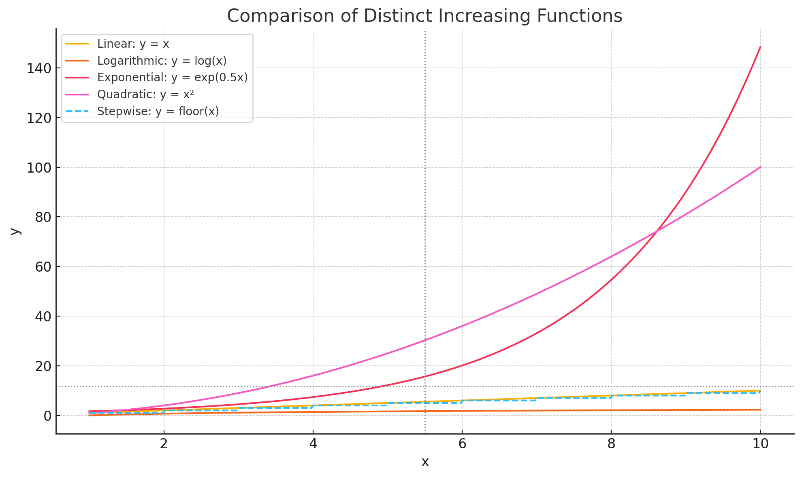

***
# 游戏名称：**MD5大作战**

## 一些注意事项
由于ts无严格的区分整形和浮点型的机制，所有数字变量均为number（double）类型，因此下述所有数字指标均为浮点型。

## 游戏布局
        该游戏为在微信小程序中进行游玩，设计时需特别注意竖屏排版，以给用户最佳的视觉体验。排版安排如下：

## 设计思路
        游戏设定分为4个子阵营，分别为苏，盟，尤里，焚风四大阵营，玩家在开始游戏时可自主选择,每个阵营都有自己独特的被动技能，和必杀技。玩家具体属性根据玩家昵称的MD5散列值进行生成,并且属性会随着战斗发生增加
        技能分为三类，1.普通攻击，2.技能，3.必杀技;每次攻击时随机选择释放技能或者普通攻击，如果战斗回合过长会将调整攻击策略10轮（暂定）战斗释放一次必杀技，用于推动战斗进程，减少单局时间。
        为了平衡不同阵营的游玩体验，将对每个阵营的玩家采取不同的成长曲线，（长有限制）

## 关于玩家
### 主要属性
每个玩家拥有4个决定胜负的主要因素。  
这些因素是： 
- 生命值
- 主动技能
- 被动技能
- 成长加成

其余的次要因素有：  
- 阵营
### 如何初始化主要属性
每个玩家除阵营外的信息在开始时由昵称初始化，阵营信息由玩家自主选择。  
由昵称获得md5字符串，长度为32。  
详细见下。

## 生命值
每个玩家的生命值在1000之内，由前8位十六进制数（0-1024）对1000取模得到

## 技能配置
### 概述
一共有5个技能。其中分为
- 普通攻击（1）
- 阵营特效攻击（阵营划分只影响技能贴图）（2+1）
- 必杀技（阵营划分只影响技能贴图）（1）

其中，阵营特效攻击包含
- 主动技能（2）
- 被动技能（1）

必杀技算作主动技能。

### 普通攻击参数
普通攻击伤害在0-16之间，由第8位字符（0-16）计算得到。

### 主动技能参数
每个主动技能有以下几个参数，其中，必杀技在以下各指标的基础上*2，概率大于一的话按1算。
- 对敌伤害  第9位字符*4（0-64）
- 暴击概率 （范围：0-1）  **由第10位字符除16归一化得到**
- 暴击伤害 （11-12位字符，100-256）**不足100的话加100**
### 被动技能参数
- 闪避概率 范围（0-0.2）**13-14位归一化后*0.2**
- 反弹概率 范围（0-0.1）**15-16位归一化后乘0.1**
- 反弹比例 范围（0-0.5）**17-18位归一化后乘0.5**

## 关于阵营信息
阵营信息会影响玩家的角色贴图，技能贴图，以及成长属性（不同阵营玩家有不同的成长属性）。**成长属性通过作用于生命值和技能参数影响游戏结果**。

## 关于成长属性
以下是5种不同的成长曲线，前四条分别对应4个阵营。曲线在后续使用时需确保最大值相同。成长属性可以按完成百分比（x=10算完成），在1-2之间对生命值，主被动技能进行乘法系数加成。
