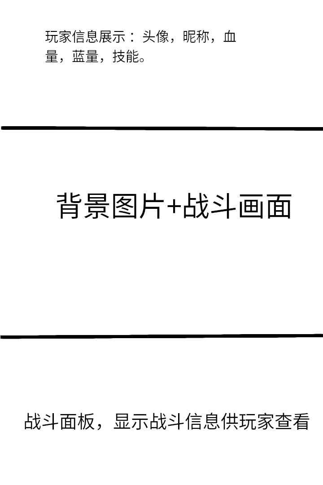

***
# 游戏名称：**MD5大作战**

## 游戏布局：
        该游戏为在微信小程序中进行游玩，设计时需特别注意竖屏排版，以给用户最佳的视觉体验。排版安排如下：

## 设计思路：
        游戏设定分为4个子阵营，分别为苏，盟，尤里，焚风四大阵营，玩家在开始游戏时可自主选择,每个阵营都有自己独特的被动技能，和必杀技。玩家具体属性根据玩家昵称的MD5散列值进行生成,并且属性会随着战斗发生增我
        技能分为三类，1.普通攻击，2.技能，3.必杀技;每次攻击时随机选择释放技能或者普通攻击，如果战斗回合过长会将调整攻击策略10轮（暂定）战斗释放一次必杀技，用于推动战斗进程，减少单局时间。
        为了平衡不同阵营的游玩体验，将对每个阵营的玩家采取不同的成长曲线，（长有限制）